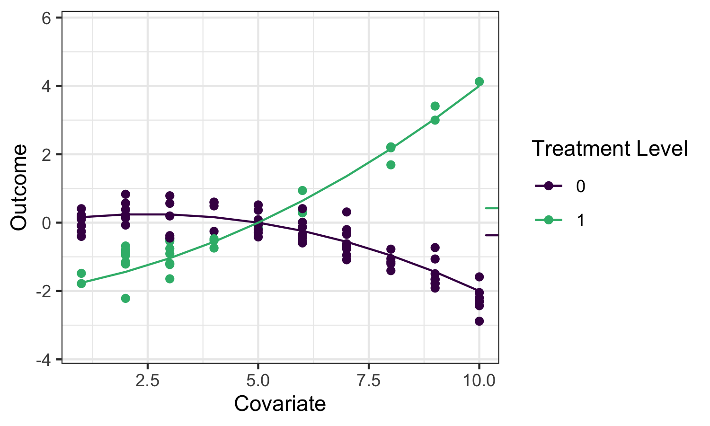
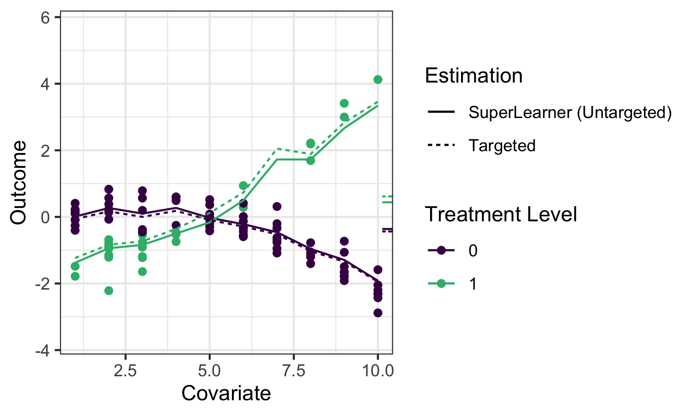
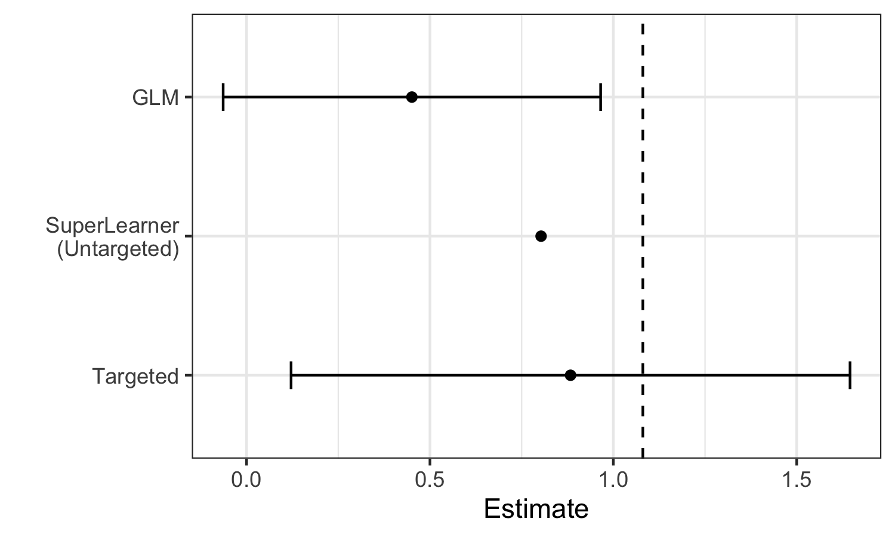

### The TMLE Framework {#tmle3}

_Jeremy Coyle_ and _Nima Hejazi_

Based on the [`tmle3` `R` package](https://github.com/tlverse/tmle3).

## Learning Objectives {#learn-tmle}

By the end of this chapter, you will be able to

1. Understand why we use TMLE for effect estimation.
2. Use `tmle3` to estimate an Average Treatment Effect (ATE).
3. Understand how to use `tmle3` "Specs" objects.
4. Fit `tmle3` for a custom set of target parameters.
5. Use the delta method to estimate transformations of target parameters.

## Introduction {#tmle-intro}

* In the previous chapter on `sl3` we learned how to estimate a regression
function like $\mathbb{E}[Y \mid X]$ from data. 
* That's an important first step
in learning from data, but how can we use this predictive model to estimate
statistical and causal effects?

---

* Going back to [the roadmap for targeted learning](#intro), suppose we'd like to
estimate the effect of a treatment variable $A$ on an outcome $Y$. 
* As discussed,
one potential parameter that characterizes that effect is the Average Treatment
Effect (ATE):

$\psi_0 = \mathbb{E}_W[\mathbb{E}[Y \mid A=1,W] -
\mathbb{E}[Y \mid A=0,W]]$ 

* This is interpreted  as the difference in mean outcome
under when treatment $A=1$ and $A=0$, averaging over the distribution of
covariates $W$.

---

We'll illustrate several potential estimators for this
parameter, and motivate the use of the TMLE framework, using the
following example data:

```{r tmle_fig1, results="asis", echo = FALSE}

```

<aside class="notes">
The small ticks on the right indicate the mean outcomes (averaging over $W$)
under $A=1$ and $A=0$ respectively, so their difference is the quantity we'd
like to estimate.

While we hope to motivate the application of TMLE in this chapter, we refer the
interested reader to the two Targeted Learning books and associated works for
full technical details.
</aside>

## Substitution Estimators {#substitution-est}

* We can use `sl3` to fit a Super Learner or other regression model to estimate
the outcome regression function $\mathbb{E}_0[Y \mid A,W]$, which we often refer
to as $\overline{Q}_0(A,W)$ and whose estimate we denote $\overline{Q}_n(A,W)$.
* To construct an estimate of the ATE $\psi_n$, we need only "plug-in" the
estimates of $\overline{Q}_n(A,W)$, evaluated at the two intervention contrasts,
to the corresponding ATE "plug-in" formula:


$\psi_n = \frac{1}{n}\sum(\overline{Q}_n(1,W)-\overline{Q}_n(0,W))$. 

---

* This kind of estimator is called a _plug-in_ or _substitution_ estimator, since accurate
estimates $\psi_n$ of the parameter $\psi_0$ may be obtained by substituting
estimates $\overline{Q}_n(A,W)$ for the relevant regression functions
$\overline{Q}_0(A,W)$ themselves.

---

Applying `sl3` to estimate the outcome regression in our example, we can see
that the ensemble machine learning predictions fit the data quite well:

```{r tmle_fig2, results="asis", echo = FALSE}

```

<aside class="notes">
The solid lines indicate the `sl3` estimate of the regression function, with the
dotted lines indicating the `tmle3` updates [(described below)](#tmle-updates).
</aside>

---

* While substitution estimators are intuitive, naively using this approach with a
Super Learner estimate of $\bar{Q}_0(A,W)$ has several limitations: 
  1. Super Learner is selecting learner weights to minimize risk across the entire
regression function, instead of "targeting" the ATE parameter we hope to
estimate, leading to biased estimation. `sl3` is trying to do well on
the full regression curve on the left, instead of focusing on the small ticks on
the right.
  2. More importantly, the sampling distribution of this approach is not
asymptotically linear, and therefore inference is not possible.

---

We can see these limitations illustrated in the estimates generated for the
example data:

```{r tmle_fig3, results="asis", echo = FALSE}

```

<aside class="notes">
We see that Super Learner, estimates the true parameter value (indicated by the
dashed vertical line) more accurately than GLM. However, it is still less
accurate than TMLE, and valid inference is not possible. In contrast, TMLE
achieves a less biased estimator and valid inference.
</aside>

## Targeted Maximum Likelihood Estimation {#tmle}

* TMLE takes two  estimates:
  1. An initial estimate $\overline{Q}_n(A,W)$
  2. an estimate of the propensity score $g_n(A \mid W) = \mathbb{P}(A = 1 \mid W)$ 
* It uses these to produce an updated estimate $\overline{Q}^{\star}_n(A,W)$ that is "targeted" to the
parameter of interest.

---

* TMLE keeps the benefits of substitution estimators (it is
one), but augments the original, potentially erratic estimates to _correct for
bias_
* It also results in an _asymptotically linear_ (and thus normally
distributed) estimator that accommodates inference via asymptotically consistent
Wald-style confidence intervals.

## TMLE Updates {#tmle-updates}

* There are different types of TMLEs (and, sometimes, multiple for the same set of
target parameters) -- here, we give an example of the algorithm for TML
estimation of the ATE.

---

* $\overline{Q}^{\star}_n(A,W)$ is the TMLE-augmented
estimate $f(\overline{Q}^{\star}_n(A,W)) = f(\overline{Q}_n(A,W)) + \epsilon
\cdot H_n(A,W)$
  * $f(\cdot)$ is the appropriate link function (e.g.,
$\text{logit}(x) = \log\left(\frac{x}{1 - x}\right)$)
  * $\epsilon_n$ is an estimate of the coefficient $\epsilon$ of the "clever covariate" $H_n(A,W)$
* The form of the covariate $H_n(A,W)$ differs across target
parameters; in this case of the ATE, it is 
$H_n(A,W) = \frac{A}{g_n(A \mid W)} -\frac{1-A}{1-g_n(A, W)}$
  * $g_n(A,W) = \mathbb{P}(A=1 \mid W)$ is the estimated propensity score

<aside class="notes">

The estimator depends both on the initial fit (by
`sl3`) of the outcome regression ($\overline{Q}_n$) and of the propensity score
($g_n$).

There are several robust augmentations that are used across the `tlverse`,
including the use of an additional layer of cross-validation to avoid
over-fitting bias (i.e., CV-TMLE) as well as approaches for more consistently
estimating several parameters simultaneously (e.g., the points on a survival
curve).
</aside>

## Statistical Inference {#tmle-infer}

* Since TMLE yields an **asymptotically linear** estimator, obtaining statistical
inference is very convenient.
* Each TML estimator has a corresponding
**(efficient) influence function** (often, "EIF", for short) that describes the
asymptotic distribution of the estimator.
* By using the estimated EIF, Wald-style
inference (asymptotically correct confidence intervals) can be constructed
simply by plugging into the form of the EIF our initial estimates
$\overline{Q}^{\star}_n$ and $g_n$, then computing the sample standard error.

---

The following sections describe both a simple and more detailed way of
specifying and estimating a TMLE in the `tlverse`. In designing `tmle3`, we
sought to replicate as closely as possible the very general estimation framework
of TMLE, and so each theoretical object relevant to TMLE is encoded in a
corresponding software object/method. First, we will present the simple
application of `tmle3` to the WASH Benefits example, and then go on to describe
the underlying objects in greater detail.


## Summary

`tmle3` is a general purpose framework for generating TML estimates. The easiest
way to use it is to use a predefined spec, allowing you to just fill in the
blanks for the data, variable roles, and `sl3` learners. However, digging under
the hood allows users to specify a wide range of TMLEs. In the next sections,
we'll see how this framework can be used to estimate advanced parameters such as
optimal treatments and stochastic shift interventions.
